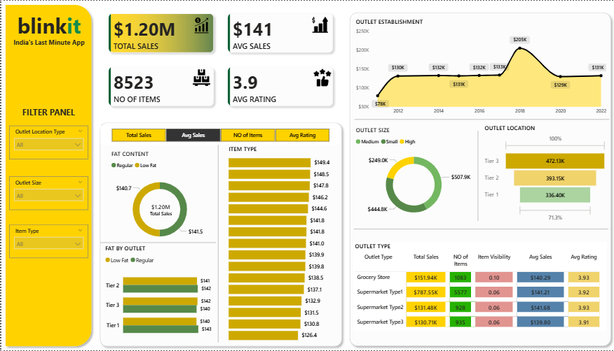

# Blinkit Sales Analysis & Business Intelligence Dashboard

---

## What This Project Is About

Blinkit operates as a last-minute grocery delivery app across India.
The data behind it — 8,600 rows and 12 columns — tells a very 
specific story about what people buy, where they buy it from, and 
which outlets are actually driving revenue.

This project takes that raw grocery sales data and works through it 
in two stages. First, a Python-based exploration in Google Colab to 
understand what the numbers actually say. Then a Power BI dashboard 
to make those findings usable for someone who needs to make decisions 
quickly without digging through spreadsheets.

---

## The Problem I Started With

Blinkit has multiple outlet types, multiple city tiers, and hundreds 
of product categories. Without breaking the data down properly, it 
is impossible to know which outlets deserve more investment, which 
product categories are carrying the revenue, and whether customers 
in Tier 3 cities behave differently from those in Tier 1.

That is what this project tries to answer.

---

## The Numbers That Came Out

Total sales across the dataset :- $1.20M
Average sales per transaction :- $141
Total items sold :- 8,523
Average customer rating :- 3.9 out of 5

These four numbers sit at the top of the dashboard and update 
instantly whenever any filter is applied.

---

## What the Data Showed

### Fat Content Split:-

64.6% of all sales came from Low Fat products.
Regular products accounted for the remaining 35.4%.

Customers are clearly leaning toward healthier options. This is 
not a marginal difference — nearly two thirds of all purchases 
are low fat. That is a pattern worth paying attention to for 
inventory planning.

### Top Performing Product Categories:-

Fruits and Vegetables :- $178K
Snack Foods :- $175K
Household Items :- $135K
Frozen Foods :- $118K
Dairy :- $101K

The top two categories are almost identical in revenue. Blinkit 
is being used primarily for daily essentials and quick grocery 
runs — not for specialty or premium products.

### Outlet Size Performance:-

Medium outlets :- 42% of total sales
Small outlets :- 37% of total sales
High outlets :- 21% of total sales

Medium sized outlets are the strongest performers. Large format 
stores are not driving proportionally more revenue despite 
presumably higher operating costs.

### Outlet Location — City Tier Breakdown:-

Tier 3 cities :- $472.13K
Tier 2 cities :- $393.15K
Tier 1 cities :- $336.40K

This was the most unexpected finding. Tier 3 cities generated 
the highest revenue — nearly $136K more than Tier 1. Quick 
commerce demand is clearly not limited to metros. Smaller cities 
are driving the majority of volume.

### Outlet Type Comparison:-

Supermarket Type 1 :- $787.55K from 5,577 items, avg rating 3.92
Grocery Store :- $151.94K from 1,083 items, avg rating 3.93
Supermarket Type 2 :- $131.48K from 928 items, avg rating 3.93
Supermarket Type 3 :- $130.71K from 935 items, avg rating 3.91

Supermarket Type 1 dominates by a massive margin. It handles 
nearly 5 times the revenue of the next closest outlet type.

### Outlet Establishment Year:-

Sales peaked in 2018 at $205K and have since stabilized around 
$129K to $131K in recent years. Outlets established between 
2015 and 2018 show the strongest performance, suggesting a 
maturity curve where outlets take a few years to build volume.

---

## How the Dashboard Works

The left panel has 3 filter slicers:-

Outlet Location Type :- Switch between Tier 1, Tier 2, Tier 3 
or view all together

Outlet Size :- Filter by Small, Medium or High to compare 
how size affects every metric on the page

Item Type :- Narrow down to any specific product category 
to see its sales, average rating and item count in isolation

Every chart, KPI card and table on the dashboard updates the 
moment you change any of these filters. The 4 metric buttons 
at the top — Total Sales, Avg Sales, No of Items, Avg Rating — 
let you switch the primary measure being shown across all visuals 
simultaneously using a DAX field parameter.

---

## What I Built Technically

The dataset has 8,600 rows and 12 columns covering item attributes, 
outlet characteristics, sales values and customer ratings.

In Python I used Pandas to clean the data, handle missing values 
in Item Weight and Outlet Size, and standardise the fat content 
labels which had inconsistent entries like LF and low fat instead 
of Low Fat.

In Power BI I built the full data model, wrote DAX measures for 
all KPIs, and built a field parameter so the 4 metric toggle 
buttons work across every visual with a single click.

---

## Tools Used:-

Python, Pandas, Matplotlib, Google Colab, Power BI, DAX,
Power Query, Field Parameters

---

## Files in This Repository:-

Blinkit_Dashboard.png        :- Dashboard screenshot
blinkit_dashboard.pbix       :- Full working Power BI file
Blinkit_Analysis.ipynb       :- Python EDA notebook
blinkit_data.csv             :- Cleaned dataset
BlinkIT Grocery Data.xlsx    :- Original raw dataset

---

## What I Took Away From This

The Tier 3 city finding changed how I think about quick commerce 
in India. Every assumption going in was that metros would dominate. 
The data said the opposite — $472K from Tier 3 versus $336K from 
Tier 1 is not a small gap.

The other thing that stood out was how little outlet size mattered 
compared to outlet type. A medium Supermarket Type 1 consistently 
outperformed larger grocery stores. Size is not the variable that 
drives performance here — format is.
